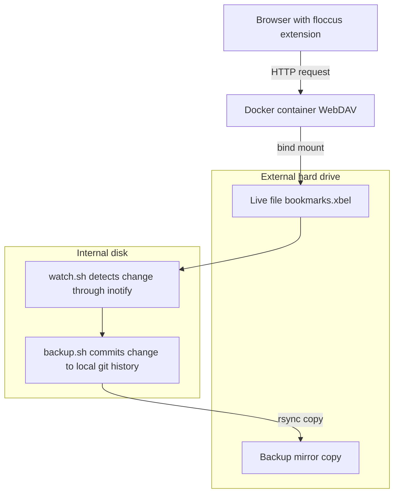

# floccus backup guard

An event driven backup pipeline for browser bookmarks synced through
[floccus](https://floccus.org/), plus a self healing setup for running the
WebDAV backend on a removable external hard drive.

## Problem

A floccus sync from an empty or broken browser can silently overwrite the
shared remote bookmarks file, wiping every other synced browser too. If
that file lives on a removable drive, an unclean disconnect while it is
being written can also corrupt it or leave services in a broken state.

This project solves both. Every change is captured into a local git
history on your internal disk, and the WebDAV service starts and stops
automatically with the external hard drive.

## Architecture



Live data stays on the external hard drive. The watcher, the backup
script, and the permanent git history stay on the internal disk, so the
backup survives even if the external hard drive fails. A mirrored copy is
also kept on the external hard drive.

## Requirements

* Docker and Docker Compose
* git
* inotify tools
* A Linux distribution using systemd
* An external hard drive formatted as ext4

## Download

```bash
git clone https://github.com/jevonzeev/floccusBackupGuard.git
```

Place the cloned folder on your internal disk, not on the external hard
drive it manages.

## Setup

1. Install inotify tools.
```bash
sudo apt install inotify tools
```

2. Copy `docker-compose.yml` and fill in your own username and password.

3. Find your external hard drive's UUID.
```bash
sudo blkid
```

4. Add an automount entry to `/etc/fstab` using that UUID.
```
UUID=your uuid here  /mnt/EXTERNALDRIVE  ext4  nofail,x-systemd.automount,x-systemd.device-timeout=10  0  2
```
```bash
sudo systemctl daemon-reload
```

5. Copy the two service templates from `systemd/` into
`/etc/systemd/system/`, editing the mount unit name and file paths to
match your setup.
```bash
sudo cp systemd/webdav_sync.service /etc/systemd/system/
sudo cp systemd/bookmark_watch.service /etc/systemd/system/
sudo systemctl daemon-reload
sudo systemctl enable now webdav_sync.service bookmark_watch.service
```

6. Optional. Add a cron fallback in case the watcher ever stops silently.
```
*/15 * * * * /path/to/floccus backup guard/backup.sh
```

## Checking status

```bash
systemctl status webdav_sync.service
systemctl status bookmark_watch.service
findmnt /mnt/EXTERNALDRIVE
docker ps
```

## Recovering from a bad sync

```bash
cd backup-staging
git log --oneline -- bookmarks.xbel
sudo sh -c 'git show <commit-hash>:bookmarks.xbel > /path/to/data/bookmarks.xbel'
```

Must be run as `sudo sh -c '...'`, not `sudo git show ...`, because the
live file is owned by the WebDAV container's user. See
[TROUBLESHOOTING.md](TROUBLESHOOTING.md) for why.

## Floccus error E030 (failed to decrypt)

Check the file size first.
```bash
stat /path/to/data/bookmarks.xbel
```

Zero bytes means truncation. A normal size that still won't decrypt
usually means a passphrase mismatch. Either way, the fix is to delete the
file and let floccus rebuild it.
```bash
curl -u <username> -X DELETE http://localhost:8085/bookmarks.xbel
```

Then sync from a browser with good bookmarks, and use that same
passphrase on every device afterward. See
[TROUBLESHOOTING.md](TROUBLESHOOTING.md) for the full explanation.

## License

MIT. See [LICENSE](LICENSE).
